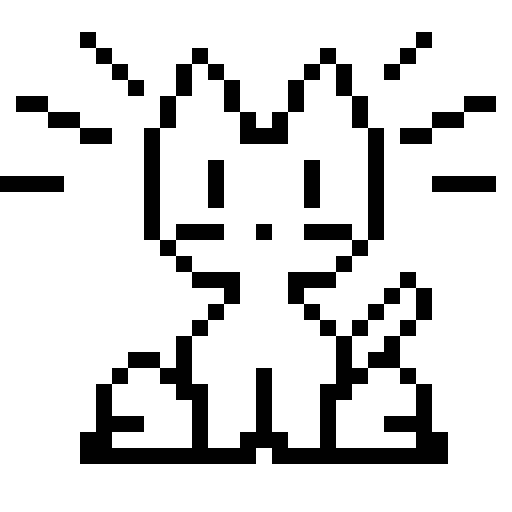
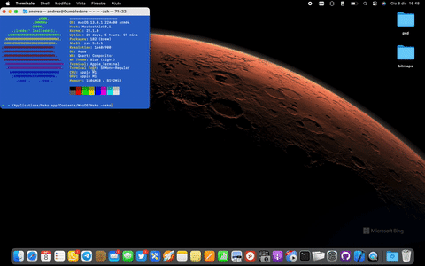

 
# (Neko)

A Mac OS X port of the [Neko program](http://en.wikipedia.org/wiki/Neko_%28computer_program%29) written in Objective-C. 

## Installation
Copy Neko app in Applications folder, launch it  
This program does not show up in the dock. To close it, you either need to open
the terminal and type `killall Neko` or open the Activity Monitor and quit
Neko

To use option launch app from terminal 
`/Applications/Neko.app/Contents/MacOS/Neko -dog`

Option are: 
-neko Use neko gif 
-dog Use dog gif 
-tomoyo Use tomoyo gif 
-h This guide  
 

[tuttologico.it](https://tuttologico.it)
